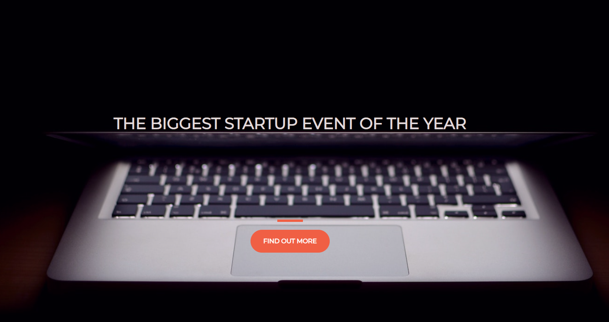
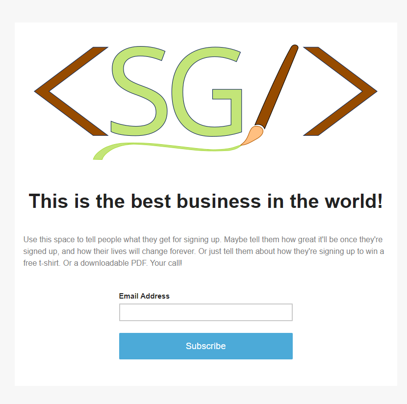

# STARTUP LANDING PAGE<!-- omit in toc -->

 

## Version 1.0<!-- omit in toc -->

- **Project Start:** February 9, 2022
- **Project End:** February 10, 2022

 

# CONTENTS
- [CONTENTS](#contents)
  - [Introduction](#introduction)
  - [Screenshots](#screenshots)
  - [Methodology](#methodology)
  - [Tools I Used](#tools-i-used)
  - [What I learned](#what-i-learned)
  - [Items for further study](#items-for-further-study)
  - [About me](#about-me)
 

Introduction
---
This is a fully responsive Startup Landing page where people can sign up to receive update emails about an soon-to-be-launched Startup company.

This project is from the "Complete Web Developer in 2022: Zero to Mastery" course on the [Zero-to-Mastery website](https://zerotomastery.io/).

 

Screenshots
---

 

Methodology
---
For this project, I simply followed along with the video tutorial to get a better feel for Bootstrap.

 

Tools I Used
---
* HTML5
* CSS3
* Bootstrap
* Mailchimp

 

What I learned
---

After hearing about Bootstrap for a while, I finally see it in action. I can honestly say that I see the appeal. The ease in which you can have a lovely layout up and running quickly is awesome to me, and the fact that you can still customize elements with your own CSS is fabulous.

 

Items for further study
---
I will DEFINITELY explore Bootstrap more on my own; playing around with my own sites and familiarize myself with all the things this library can do. 

 

About me
---

Thanks for checking out this project! 😃 You can find my profiles at these sites:
- [Twitter: @IT_Sonji](https://twitter.com/sonji_it)
- [Frontend Mentor - @infinity-Mineeva](https://www.frontendmentor.io/profile/Infinity-Mineeva)
